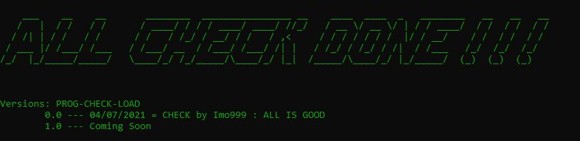
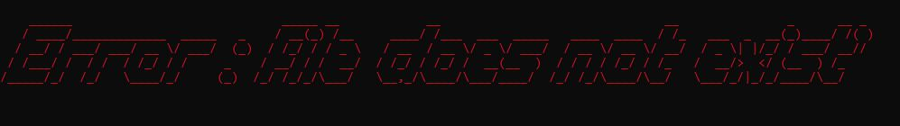

# 

Version v0.0A </br>
Author : Imo999 </br>
Date : 04/07/2021 </br>

This program allows you to check your folders and files before launching your program.


# ARCHITECTURE CHECKLOADING</br>

[1] => ERROR DIRECTORY</br>
[2] => ERROR FILE</br>
[3] => CHECK LINE CMD</br>
[4] => RUN LOADING</br>
[5] ARGUMENT RUN</br>

# 


  #################### ERROR DIRECTORY ####################</br>
   
    E-DIR : Check si le dossier existe : </br>                
    [1] pics </br>
    [2] .... Addionnal </br>


  #################### ERROR FILE ####################</br>

    E-FILE : Check si les fichiers existe et qu'ils ne sont pas des répertoires</br>
    [1] e-not-exist.txt</br>
    [2] e-note-file.txt</br>
    [3] usage-node.txt</br>
    [4] use-run-arg.txt</br>
    [5] loading-pic.txt</br>
    [6] all-check-done.txt</br>
    [7].... Addionnal </br>

# 


  #################### CHECK LINE CMD ####################</br>

    LINE CMD : Check si la commande de lancement est correct : </br>
    [0] node </br>
    [1] nom du programme.js</br>
    [2] argument 1 : run</br>

  
  #################### RUN LOADING ####################</br>

    LOADING : Affichage si tout est OK si l'argument 'RUN' est validé => ALL CHECK DONE !!!</br>


  #################### ARGUMENT RUN  ####################</br>
  
    ARG-RUN :  Si l'argument 1 n'est pas égale à 'run' alors ne pas démmarer !! </br>


## Install

```console
$ yarn
$ yarn add chalk
```

## Usage

```console
- Full Screen
- node loading.js run
- ...
```

